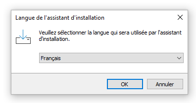

# JeanSoloProject

# Guide d'installation et d'utilisation de Jeu de la vie

## Guide d'installation
Il faut d'abord ouvrir JeuxDeLaVieSetup et la page suivante va ouvrir. Il faut choisir la langue désirée et appuyer sur OK.

Ensuite la page suivant demande le chemin désiré pour installer le jeu. Il faut entrer un chemin et appuyer sur Suivant.

La page suivante va ensuite s'afficher. Il faut cocher si oui ou non le jeu aura une icone sur le bureau et ensuite appuyer sur Suivant.

La page qui suit donne les ordres que doit suivre l'installateur. Tout ce qu'il faut faire c'est d'appuyer sur Installer.

La dernière page indique la fin de l'installation. Il faut cocher Exécuter Jeu de la vie pour démarrer le jeu immédiatement après la fermeture de l'installateur. Pour terminer, il faut appuyer sur Terminer.

## Guide d'utilisation

Lors de l'ouverture, le jeu affiche une forme générée aléatoirement et offre quelques options simple.

Le bouton Forme 1 affiche la première forme qui est la suivante.

Le bouton Forme 2 affiche la deuxième forme qui est la suivante.

Le bouton Forme 3 affiche la troisième forme qui est la suivante.

Le bouton Forme aléatoire affiche une forme aléatoire comme la suivante.

Le bouton Charger change la partie du jeu pour un dialogue demandant le nom de la sauvegarde désirée.

Le bouton Sauvegarder change la partie du jeu pour un dialogue demandant le nom désiré pour la sauvegarde

Pour démarer la partie, il faut ajouter un nombre d'itération désirée. Si le nombre est de 0 ou moins, le nombre d'itération sera de 60 000. Si aucun nombre est entré, un message demandant un nombre sera affiché.
